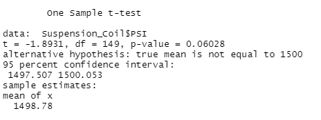

# r_autos_r_us

Statistical analysis of the mechacar data to understand the production delays
- Design a regression model which predicts the mpg of MechaCar prototypes
- The suspension coil;s PSI across all manufacturing lots

### Resources and Tools
Data Files
- MechaCar_mpg.csv
- Suspension_Coil.csv

Tools used
- R Studio

## Linear Regression to Predict MPG

Post analysis of the data, we can see that the below variables strongly co-relate with the model, as these may be fixed values
- Vehicle Length
- Ground Clearance

  

This means to improve the mpg, the prototypes can modify 3 variables to see the best impact.  

The overall model learnings
- The p-value of this is extremely low (much lower than the assumed significant level of .05%), which means there is sufficient evidence to reject the null hypothesis
- The model predicts 71% accuracy for the model, in other words the vehicle length, weight, spoiler angle, ground clearance and AWD can be used to predict the MPG with sufficient accuracy

## Summary Statistics on Suspension Coils

The current manufacturing data overall shows that the variance of suspension coils did not exceed 100 PSI.  
  

However when we look at the individual lots, we can see that Lot 3 variance is 170.28, which exceeds the MechaCar design specs.
  

## T-Tests on Suspension Coils

A t-test was conducted to determine of PSI across the lots was statistically different from the population mean of 1500 PSI.
- the p-value is 0.06 which is above the significance level

  

- The t-test comparing lot 1 to the population mean, shows a p value of 1, which means the 2 means are similar

- the p-value for lot 2 is above signifcance level as well and the 2 means are similar

- the p-value of lot 3 is below significance level and the results are not statistically similar

  

## Study Design: Comparing Mechacar to competition

### Overview
Identifying the variables which customers look for in a car and understanding how mechacar's prototypes perform with respect to competition. With this analysis we can use data from Reddit PRAW and scrape Reddit to understand sentiment about cars and and figure out different variables which are important to customers.  

Comparing prototypes with current cars in the market will help us provide Unique Selling Propositions and help us in marketing the vehicles

Key variables (for ex.)
- Cost
- Re-Sale Value (or Depreciation)

Null Hypothesis: There is no different between MechaCar's prototype variable and the market variable  
Alternative Hypothesis: There is a difference between MechaCar's prototype variable and market variable  
_for ex: MechaCar parts wear out at a 0.5X than competition therefore the re-sale value will be 2X than competition_  

This can be done using a simple t-test which will compare prototype means to market means.

